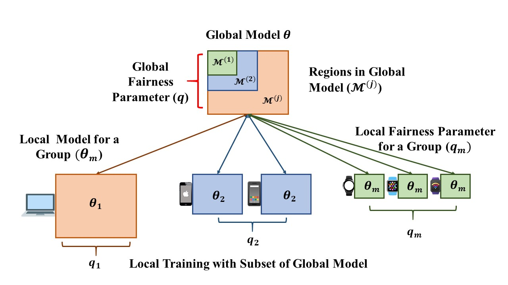

# FairHeteroFL: Hardware-Sensitive Fairness in Federated Learning with Heterogeneous Environment

This repository is the official implementation of . 

>📋  Optional: include a graphic explaining your approach/main result, bibtex entry, link to demos, blog posts and tutorials

## Requirements

To install requirements:

```setup
pip install -r requirements.txt
```
>📋  Getting Dataset Directly

You can directly download the Dataset for MNIST [MNIST IID](https://drive.google.com/file/d/1KWLSAWqeChXsKWoufc85gQ8xaG6ocUWt/view?usp=sharing), [MNIST Non-IID](https://drive.google.com/file/d/1oOcLdDUq7dAvWMWTAO9j0-ddBEesS9hh/view?usp=sharing), [MNIST Non-IID Extreme](https://drive.google.com/file/d/1ty8wQOHasDtAW1lQilI_bvq_BfbSJIPK/view?usp=sharing).

You can directly download the Dataset for CIFAR10 [CIFAR10 IID](https://drive.google.com/file/d/1vw-axxdsMDsczZAab7LO6PC8_Av4jr_g/view?usp=sharing), [CIFAR10 Non-IID](https://drive.google.com/file/d/1qRlxFQrNV_ksCavDAoW8_cMFkDAnA4hr/view?usp=sharing), [CIFAR10 Non-IID Extreme](https://drive.google.com/file/d/1qRlxFQrNV_ksCavDAoW8_cMFkDAnA4hr/view?usp=sharing).

You can directly download the Dataset for FEMNIST [FEMNIST TRAIN](https://drive.google.com/file/d/1dhwHcwHvgHGraG-OMXzVA4WrpiNLoqAV/view?usp=sharing), [FEMNIST TEST](https://drive.google.com/file/d/1Oe3yEPa2TruLkEOTLsZtipZjERBs-a1M/view?usp=sharing)

Keep the dataset in the same directory of the dataset name.

## Training

To train the model(s) in the paper, run this command:

```train
python train.py --input-data <path_to_data> --alpha 10 --beta 20
```

>📋  Describe how to train the models, with example commands on how to train the models in your paper, including the full training procedure and appropriate hyperparameters.

## Evaluation

To evaluate my model on ImageNet, run:

```eval
python eval.py --model-file mymodel.pth --benchmark imagenet
```

>📋  Describe how to evaluate the trained models on benchmarks reported in the paper, give commands that produce the results (section below).

## Pre-trained Models

You can download pretrained models here:

- [My awesome model](https://drive.google.com/mymodel.pth) trained on ImageNet using parameters x,y,z. 

>📋  Give a link to where/how the pretrained models can be downloaded and how they were trained (if applicable).  Alternatively you can have an additional column in your results table with a link to the models.

## Results

Our model achieves the following performance on :

### [Image Classification on ImageNet](https://paperswithcode.com/sota/image-classification-on-imagenet)

| Model name         | Top 1 Accuracy  | Top 5 Accuracy |
| ------------------ |---------------- | -------------- |
| My awesome model   |     85%         |      95%       |

>📋  Include a table of results from your paper, and link back to the leaderboard for clarity and context. If your main result is a figure, include that figure and link to the command or notebook to reproduce it. 


## Contributing

>📋  Pick a licence and describe how to contribute to your code repository. 
